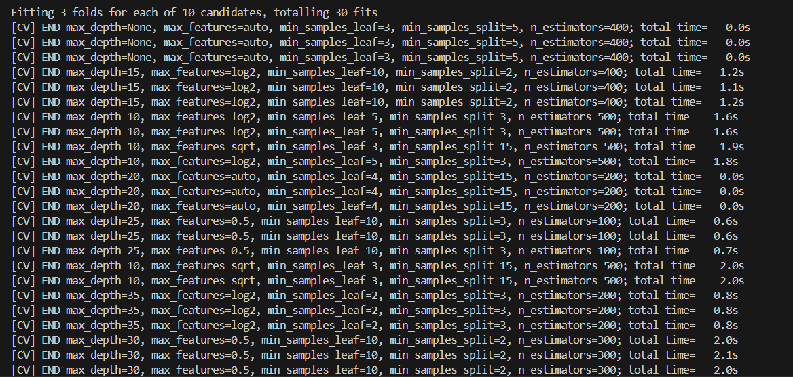
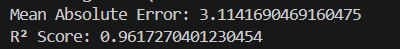

# Human Age Prediction

This project implements a machine learning model to predict human age based on various health and lifestyle factors using a Random Forest Regressor. The dataset includes features such as blood pressure, physical activity level, smoking status, and more.

## Table of Contents

- [Project Description](#project-description)
- [Installation](#installation)
- [Usage](#usage)
- [Data Preprocessing](#data-preprocessing)
- [Model Training and Evaluation](#model-training-and-evaluation)
- [Results](#results)
- [License](#license)

## Project Description

The goal of this project is to predict the age of individuals based on their health metrics and lifestyle choices. The model is trained using a dataset that includes various attributes, and it employs a Random Forest Regressor for age prediction. The code performs several key tasks:

1. **Data Loading**: Reads the dataset from a CSV file.
2. **Data Preprocessing**: Cleans and transforms the data to make it suitable for modeling.
3. **Feature Engineering**: Creates new features and encodes categorical variables.
4. **Model Training**: Splits the data into training and testing sets, scales the features, and trains a Random Forest model.
5. **Hyperparameter Tuning**: Uses Randomized Search Cross-Validation to find the best model parameters.
6. **Model Evaluation**: Evaluates the trained model using metrics like Mean Absolute Error and R² Score.

## Screenshots




## Installation

To run this project, you need to have Python installed along with the following libraries:

- pandas
- scikit-learn
- numpy

You can install the required libraries using pip:

```bash
pip install pandas scikit-learn numpy
